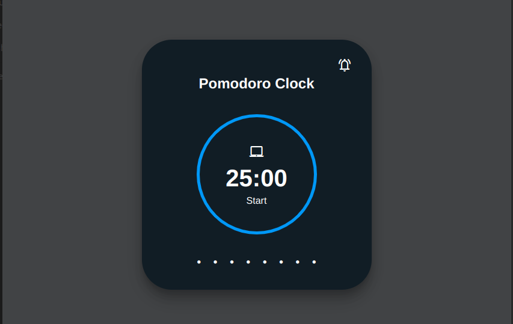

# Pomodoro Clock

Welcome to our Pomodoro Clock – a timer based on the ancient Italian Pomodoro Technique for efficient time management and enhanced productivity.

## About the App

The Pomodoro Clock follows the principles of the Pomodoro Technique, breaking down the workday into manageable 25-minute segments called Pomodoros. This app enables you to start and stop the timer at your convenience and provides alerts when each timer session ends.

## Key Features

- **Pomodoros Tracking**:  Keep track of completed Pomodoros throughout your day.

- **Play/Pause Functionality**: Pause and resume the timer whenever necessary for unplanned activities.

- **Timer Alert**: Receive audible alerts at the end of each timer session to stay on track with your tasks.

## Technologies Used

- **React**: A frontend framework for building dynamic user interfaces based on reusable components.

- **Styled Components**: A library for styling React components with scoped and dynamic CSS.

- **Vite**: A fast, modern build tool that offers instant server startup for efficient web development and minimal setup.

## Screenshots

_Pomodoro Clock (Session)_

_Pomodoro Clock (Shor Break)_

 

## Getting Started

1. Clone this repository: `git clone https://github.com/deepak-terse/pomodoro-clock.git`
2. Navigate to the project directory: `cd pomodoro-clock`
3. Install dependencies: `npm install`
4. Run the app: `npm run dev`

Feel free to use our Pomodoro Clock to boost your productivity! If you encounter any issues or have suggestions, please don't hesitate to reach out. Happy time management! ⏰🌟