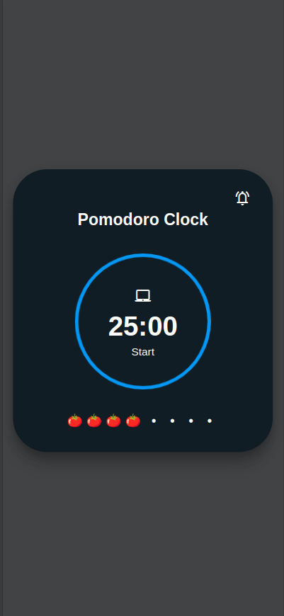
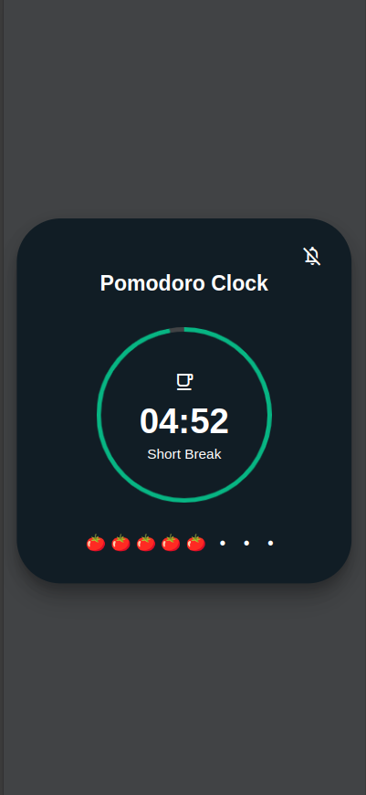

# Pomodoro Clock

Use our timer based on ancient Chinnese pomodoro technique for time management and improved productivity

## About the App

A Pomodoro Clock is based on the ancient Chineese time management technique in which one breaks the workday down into manageable 25-minute segments called 'Pomodoros. The app lets you start stop the timer and also alerts you as the timer ends. 

## Key Features

- **Pomodoros Tracking**: Keep track of the number of promodoros completed in a day

- **Play/Pause**: Play/Pause the timer anytime for unplanned activities.

- **Timer Alert**: Get notified with an alert sound at the end of every timer.

## Technologies Used

- **React**: A frontend framework that lets you create user interfaces based on components.

- **Styled Components**: A library that allows you to write CSS in JS while building custom components in Reactjs.

- **Vite**: A local development server for building web applications with minimal setup.

## Screenshots

_Pomodoro Clock (Session)_

_Pomodoro Clock (Shor Break)_

 

## Getting Started

1. Clone this repository: `git clone https://github.com/deepak-terse/pomodoro-clock.git`
2. Navigate to the project directory: `cd pomodoro-clock`
3. Install dependencies: `npm install`
4. Run the app: `npm run dev`

Feel free to use our Pomodoro Clock to boost your productivity! If you encounter any issues or have suggestions, please don't hesitate to reach out. Happy time management! ⏰🌟